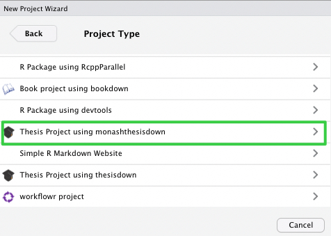
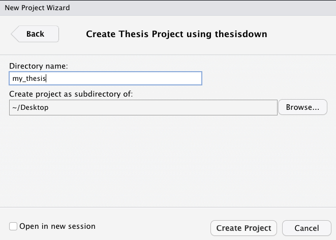

# Welcome!

<!-- badges: start -->

[](https://lifecycle.r-lib.org/articles/stages.html#stable) [](THANKS.md) [](https://choosealicense.com/)

<!-- badges: end -->

This is a minimal Thesis template based on R Markdown, [bookdown](https://github.com/rstudio/bookdown) and [thesisdown](https://github.com/ismayc/thesisdown). This template originally designed to work with the Monash University Thesis guidelines. Currently this template is functional in knitting gitbook and PDF version.

The monashthesis.tex and monashthesis.cls are collected from Prof' Rob J Hyndman's [github repository](https://github.com/robjhyndman/MonashThesis) and modified to the updated guidlines. I have commented out **186 number** line in **monashthesis.cls** to sync with the guideline. If you want a logo please activate line 186.

## Current Functional Output

-   PDF

-   epub

-   gitbook

## How to use

Make you sure you have **rmakrdown,** **bookdown** and **thesisdown** packages installed. You also need to have have a LaTex installed. **tinytex** can help you in that regards

```{r}
install.packages(c('tinytex', 'rmarkdown'))
tinytex::install_tinytex()
# after restarting RStudio, confirm that you have LaTeX with
tinytex:::is_tinytex()


```

To use monashthesisdown with your R studio:

1.  Make sure you have LaTeX and the latest version of RStudio.

2.  Install bookdown and thesisdown packages

    ```{r}
    if (!require("remotes")) 
      install.packages("remotes", repos = "https://cran.rstudio.org")
    remotes::install_github("rstudio/bookdown")
    remotes::install_github("ismayc/thesisdown")
    remotes::install_github("masiraji/monashthesisdown")

    ```

After installing these restart your Rstudio.

3\. In Rstudio you can get started with monashthesisdown by clicking **File** \> **New Project** \> **New Directory and** selecting **Thesis project using monashthesisdown**



Next, give your project a name and specify where you'd like the files to appear. In the screenshot below, the project name is `my_thesis` and it will appear as a new folder on my Desktop.



### **Day-to-day writing of your thesis**

Each chapter of your thesis should be in different .Rmd files. If you want specific LaTeX packages to add, put them in monashthesis.tex. This template provides a skeleton file structure that you can edit to create your thesis. Edit the \*\*\_bookdown.yml\*\* file to set the order in which you'd like them to appear. It's recommended that you version control your thesis using GitHub if possible. see this [link](https://happygitwithr.com) to know more about github based version controlling in Rstudio.

## **Rendering**

This package use `render_book` command from bookdown package to render PDF and gitbook version of your thesis in accordance with the guidline of Monash University. Any change that you want to bring in can be done by modifying **monashthesis.cls file.**

```{r}
bookdown::render_book("index.Rmd", "bookdown::gitbook")
bookdown::render_book("index.Rmd", "bookdown::pdf_book")

```

## **Components**

The following components are ones you should edit to customize your thesis:

### **`_bookdown.yml`**

Edit the \*\*\_bookdown.yml\*\* file to set the order in which you'd like the Rmd files to appear.

### **`index.Rmd`**

This file contains all the meta information that goes at the beginning of your document. You'll need to edit the top portion of this file (the YAML) to put your name on the first page, the title of your thesis, etc. Note that you need to have at least one chapter start in the `index.Rmd` file for the build to work.

### **`00-abstact.Rmd`, `01-chap1.Rmd`, etc.**

These are the Rmd files for each chapter in your dissertation. Write your thesis in these. If you're writing in RStudio, you may find the [wordcount addin](https://github.com/benmarwick/wordcountaddin) useful for getting word counts and readability statistics in R Markdown documents.

### **`bib/`**

Store your bibliography (as bibtex files) here. We recommend using the [citr addin](https://github.com/crsh/citr) and [Zotero](https://www.zotero.org/) to efficiently manage and insert citations.

### **`csl/`**

Specific style files for bibliographies should be stored here. A good source for citation styles is<https://github.com/citation-style-language/styles#readme>.

### **`figure/` and `data/`**

Store your figures and data here and reference them in your R Markdown files. See the [bookdown book](https://bookdown.org/yihui/bookdown/) for details on cross-referencing items using R Markdown.
