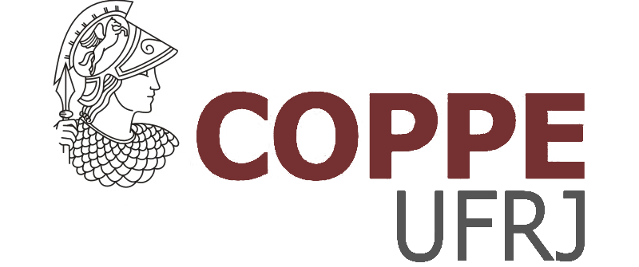

# coppedown 

This project provides a template for writing a PhD thesis in R Markdown, and rendering those files into a PDF formatted according to [the requirements of Coppe-UFRJ](https://coppe.ufrj.br/sites/default/files/arquivo_cpgp/anexos.doc). It uses the [coppetex class](http://coppetex.sourceforge.net/) to convert R Markdown files into a PDF formatted ready for submission at UW. This project was inspired by the [thesisdown](https://github.com/ismayc/thesisdown), [huskydown](https://github.com/benmarwick/huskydown) and [bookdown](https://github.com/rstudio/bookdown) packages.

Currently, the PDF and gitbook versions are fully-functional, and are the focus of this package. The word and epub versions are in development, have no templates behind them, and are essentially calls to the appropriate functions in bookdown.

If you are new to working with `bookdown` and `rmarkdown`, please read over the documentation available in coppedown PDF template (which you can create by following the simple instructions below) and the [bookdown book](https://bookdown.org/yihui/bookdown/).

Under the hood, the [Coppe-UFRJ Thesis LaTeX template](http://coppetex.sourceforge.net/) is used to ensure that documents conform precisely to submission standards. At the same time, composition and formatting can be done using lightweight [markdown](http://rmarkdown.rstudio.com/authoring_basics.html) syntax, and **R** code and its output can be seamlessly included using [rmarkdown](http://rmarkdown.rstudio.com).

## Using coppedown to write your PhD thesis

### Initial setup

Using **coppedown** has some prerequisites, such as Pandoc, LaTeX and some fonts. To compile PDF documents using **R**, you need to have Pandoc, LaTeX and several related packages installed. If you have a recent version of  [RStudio](http://www.rstudio.com/products/rstudio/download/), then you already have Pandoc and don't need to do anything more about that. 

Next is LaTeX. By far the easiest way to install LaTeX on any platform is with the [`tinytex`](https://yihui.name/tinytex/) package:

```
install.packages(c('tinytex', 'rmarkdown'))
tinytex::install_tinytex()
# after restarting RStudio, confirm that you have LaTeX with 
tinytex:::is_tinytex()
# install additional needed latex packages
tinytex::tlmgr_install("babel-portuges")
```

### Starting to write your thesis

To use **coppedown** from [RStudio](http://www.rstudio.com/products/rstudio/download/):

1) Ensure that you have already installed LaTeX and the fonts described above, and are using the latest version of [RStudio](http://www.rstudio.com/products/rstudio/download/). You can use coppedown without RStudio. For example, you can write the Rmd files in your favourite text editor (e.g. [Atom](https://atom.io/), [Notepad++](https://notepad-plus-plus.org/)). But RStudio is probably the easiest tool for writing both R code and text in your thesis. 

2) Install the **bookdown** and **coppedown** packages: 

```
if (!require("devtools")) install.packages("devtools", repos = "http://cran.rstudio.org")
devtools::install_github("rstudio/bookdown")
devtools::install_github("mralbu/coppedown")
```

3) Use the **New R Markdown** dialog to select **Thesis**, here are the steps, and a screenshot below:

File -> New File -> R Markdown... then choose 'From template', then choose 'Thesis, and enter `index` as the **Name**. Note that this will currently only **Knit** if you name the directory `index` at this step. 


Or if you're not using RStudio, run this line in your R console to create a new PhD thesis from the template:

```r
rmarkdown::draft('index.Rmd', template = 'thesis', package = 'coppedown', create_dir = TRUE)
```

### Day-to-day writing of your thesis 

You need to edit the individual chapter R Markdown files to write your thesis. 

You can write in the Rmd files without RStudio (in fact RStudio lacks some conveniences for writing, such as live spell-checking and live word count). So you may prefer to do some writing and editing your Rmd files in your favourite text editor. I frequently use [Atom](https://atom.io/), [Notepad++](https://notepad-plus-plus.org/), and [Emacs](https://www.gnu.org/software/emacs/). But I come back to RStudio to create the PDF and work on the R code in my documents. 

While writing, you should `git commit` your work frequently, after every major activity on your thesis. For example, every few paragraphs or section of text, and after major step of analysis development. You should `git push` at the end of each work session before you leave your computer or change task. For gentle novice-friendly guide to getting starting with using Git with R and RStudio, see <http://happygitwithr.com/>.

## Rendering

To render your thesis into a PDF, open `index.Rmd` in RStudio and then click the "knit" button. To change the output formats between PDF, gitbook and Word , look at the `output:` field in `index.Rmd`and comment-out the formats you don't want.

Alternatively, if you're not using RStudio, you can use this from the R console, assuming your have set the `'index/` directory as your working directory:

```r
bookdown::render_book('index.Rmd', coppedown::thesis_pdf(latex_engine = 'xelatex'))
```

The PDF file of your thesis will be deposited in the `_book/` directory.

## Components

The following components are ones you should edit to customize your thesis:

### `_bookdown.yml`

This is the main configuration file for your thesis. It determines what Rmd files are included in the output, and in what order. Arrange the order of your chapters in this file and ensure that the names match the names in your folders. 

### `index.Rmd`

This file contains all the meta information that goes at the beginning of your
document. You'll need to edit this to put your name on the first page, the title of your thesis, etc.

### `01-chap1.Rmd`, `02-chap2.Rmd`, etc.

These are the Rmd files for each chapter in your dissertation. Write your thesis in these. If you're writing in RStudio, you may find the [wordcount addin](https://github.com/benmarwick/wordcountaddin) useful for getting word counts and readability statistics in R markdown documents. You might also enjoy writing in these Rmd files with [Atom](https://atom.io/), [Notepad++](https://notepad-plus-plus.org/), [Sublime Text](https://www.sublimetext.com/), and [Emacs](https://www.gnu.org/software/emacs/). 

### `bib/`

Store your bibliography (as bibtex files) here. We recommend using the [citr addin](https://github.com/crsh/citr) and [Zotero](https://www.zotero.org/) to efficiently manage and insert citations. 

### `csl/`

Specific style files for bibliographies should be stored here. A good source for
citation styles is https://github.com/citation-style-language/styles#readme

### `figure/` and `data/`

Store your figures and data here and reference them in your R Markdown files. See the [bookdown book](https://bookdown.org/yihui/bookdown/) for details on cross-referencing items using R Markdown.

## Related projects

This project has drawn directly on code and ideas in the following:

- https://github.com/UWIT-IAM/UWThesis    
- https://github.com/stevenpollack/ucbthesis  
- https://github.com/suchow/Dissertate    
- https://github.com/SeungkiKwak/Kwak_S_PhD_thesis    
- https://github.com/dhalperi/uwthesis-tweaked     

Other relevant projects:

- Ed Berry's blog post ['Writing your thesis with bookdown'](https://eddjberry.netlify.com/post/writing-your-thesis-with-bookdown/), Posted on September 25, 2017    
- Rosanna van Hespen's ([@rosannavhespen](https://twitter.com/rosannavhespen?lang=en)) five blog posts on ['Writing your thesis with R Markdown'](https://rosannavanhespenresearch.wordpress.com/2016/02/03/writing-your-thesis-with-r-markdown-1-getting-started/)
- [thesisdowndss](https://github.com/mine-cetinkaya-rundel/thesisdowndss) by Mine Cetinkaya-Rundel at Duke University    
- [beaverdown](https://github.com/zkamvar/beaverdown) by Zhian Kamvar at Oregon State University

## Contributing

If you would like to contribute to this project, please start by reading our [Guide to Contributing](CONTRIBUTING.md). Please note that this project is released with a [Contributor Code of Conduct](CONDUCT.md). By participating in this project you agree to abide by its terms.

<!--
To update the PDF template stored in inst/ assuming we are at top level:

rmarkdown::draft('index.Rmd', template = 'thesis', package = 'coppedown', create_dir = TRUE, edit = FALSE)

setwd('index')

bookdown::render_book('index.Rmd', coppedown::thesis_pdf(latex_engine = 'xelatex'))

-->
