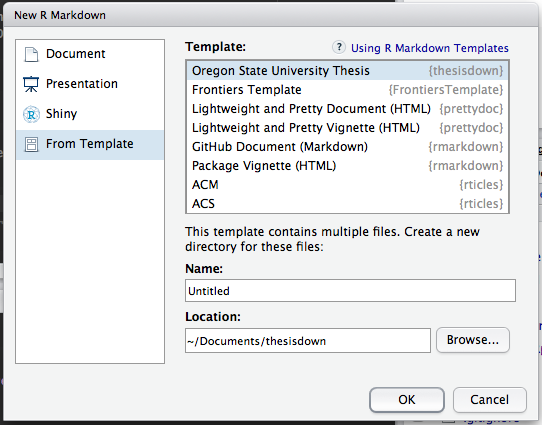

# thesisdown

This project was inspired by the [bookdown](http://github.com/rstudio/bookdown) package and is an updated version of my Senior Thesis template in the `reedtemplates` package [here](http://github.com/ismayc/reedtemplates).

Currently, the PDF version is fully-functional.  The gitbook version needs to have the preamble chapters added.  The word and epub versions have no templates behind them and are essentially calls to the appropriate functions in bookdown.

The current output for the four versions is
- [PDF](https://github.com/ismayc/thesisdown/blob/master/inst/rmarkdown/templates/thesis/skeleton/_book/thesis.pdf)
- [Word](https://github.com/ismayc/thesisdown/blob/master/inst/rmarkdown/templates/thesis/skeleton/_book/thesis.docx)
- [ePub](https://github.com/ismayc/thesisdown/blob/master/inst/rmarkdown/templates/thesis/skeleton/_book/thesis.epub)
- gitbook will be hosted soon at http://ismayc.github.io/thesisdown-book.  The needed files are [here](https://github.com/ismayc/thesisdown/tree/master/inst/rmarkdown/templates/thesis/skeleton/_book).

Under the hood, the Reed College LaTeX template (and soon the Reed College Word template) is used to ensure that documents conform precisely to submission standards. At the same time, composition and formatting can be done using lightweight [markdown](http://rmarkdown.rstudio.com/authoring_basics.html) syntax, and **R** code and its output can be seamlessly included using [rmarkdown](http://yihui.name/knitr/).

Using **thesisdown** has some prerequisites which are described below. To compile PDF documents using **R**, you are going to need to have LaTeX installed.  It can be downloaded for Windows at <http://http://miktex.org/download> and for Mac at <http://tug.org/mactex/mactex-download.html>.  Follow the instructions to install the necessary packages after downloading the (somewhat large) installer files.  You may need to install a few extra LaTeX packages on your first attempt to knit as well.

### Using thesisdown from Chester's GitHub

To use **thesisdown** from RStudio:

1) Install the latest [RStudio](http://www.rstudio.com/products/rstudio/download/).

2) Install the **thesisdown** package: 

```S
install.packages("devtools")
devtools::install_github("ismayc/thesisdown")
```

3) Use the **New R Markdown** dialog to select **Thesis**:



Note that this will currently only **Knit** if you name the directory `skeleton` as shown above.
